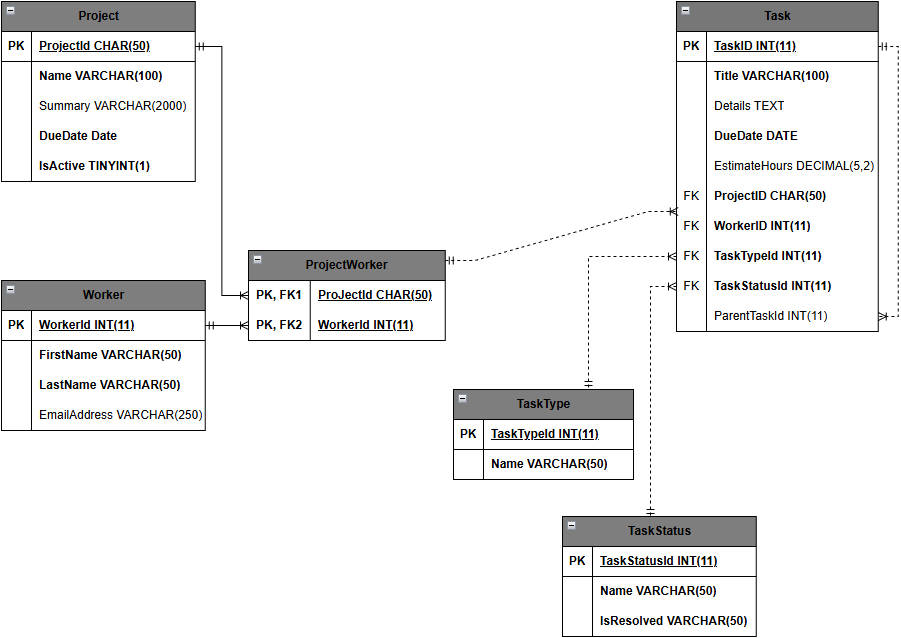

# 使用连接

目标：
- 查看数据库关系图（又称实体-关系图）中表之间的关系；
- 理解 JSON 关键字的用途；
- 使用 JSON 关键字可以在单个查询中从两个或多个表中检索数据；
- 区分内连接、外连接、交叉连接和自连接；
- 使用 SQL 别名。

## 从 schema 开始

本课使用 TrackIt schema，可通过脚本 trackit-schema-and-data.sql 创建此模式。

此数据库具有以下术语：
- **Project（项目）**
- **Worker（工人）**：一个可用于参与项目工作的人员；
- **Task（任务）**：一个离散的工作块，可以在几小时内完成。一个项目一次只完成一项任务；
- **TaskType（任务类别）**：每个任务有且只有一个类型。所以，TaskType 与 Task 是一对多的关系；
- **TaskStatus（任务状态）**：每个任务有且只有一个状态。所以，TaskStatus 与 Task 是一对多的关系。

TrackIt 一些附加关系和规则：
- Project 与 Task 是一对多关系；
- Project 与 Worker 是多对多关系；
- Worker 与 Task 是一对多关系。

一个 Task 可以与自身建立一个可选的关系。如果一个 Task 很大，则它可以被分成更小的 Task。通过在每个子行中包括父行的标识符来创建父子关系。在这个模式中没有对父子之间的层级进行限制。



## 从多个表获取数据

提供一个任务已解决的任务列表：从一个表中生成这个列表是不可能的，需要查看 TaskStatus 表。
1. 查找那些被标记为已完成的任务的 TaskStatusId；
2. 根据 TaskStatusId 在 Task 表中查找相关记录。

```sql
-- 11-1 使用 SELECT 解析任务状态
USE TrackIt;

SELECT *
    FROM TaskStatus
WHERE IsResolved = 1;
```

```sql
-- 11-2 检索 Task：使用上面查询到的 TaskStatusId 从 Task 表中获取 Task
-- 因为 TaskStatusId 碰巧是按顺序排列的，所以我们可以使用 BETWEEN。
-- 如果数据不是按顺序排列的，则我们可以使用 IN(id1, id2, idN)。
SELECT *
FROM Task
WHERE TaskStatusId BETWEEN 5 AND 8;
/*
 *  列出了 276 个已解决的任务
 * */
```

上述结果并不够稳定，要考虑以下因素：
- 如果要同时显示任务标题和状态名称，则必须手动合并这两个查询的结果。有276个任务，这需要大量复制和粘贴操作；
- 第二个查询每次执行时都可能更改。如果解析状态发生更改（如，添加、删除或编辑任务状态）则必须对查询进行更改；
- 这种方法容易出错，比如在复制时遗漏一个状态ID或包括了一个不属于它的ID。

## 使用 JOIN 子句

JOIN 子句是一个可选子句，扩展了 SELECT，便于从多个表中检索数据，并表示行之间的关系。来自一个表的行与另一个表的行连接在一起，它们的值在一个结果中进行合并。

```sql
-- JOIN 子句紧跟在 FROM 子句之后，位于 WHERE 子句之前，其基本结构为：
SELECT 
    Table1.Column1,
    Table1.Column2,
    Table2.Column1,
    Table2.ColumnN
FROM Table1
[Join Type] JOIN Table2 ON [Relationship Condition]
WHERE [Filter Condition];
/*
 *  JOIN [Table2] 将表 Table2 添加到查询中，并使其用于检索和过滤
 *  ON [Relationship Condition]（关系条件）定义了一个表中的行于另一个表中的行之间的关系
 *  JOIN 前的 [Join Type]（连接类型）确定了如何处理未匹配的行。
 *  有效值：
 *  - INNER
 *  - LEFT OUTER
 *  - RIGHT OUTER 
 *  - FULL OUTER 
 *  - CROSS
 * */
```

## INNER JOIN

只有当两张表的行根据其关系条件匹配时，INNER JOIN 才会返回结果。
一个 INNER JOIN 解决了原始方法的缺点，结果将任务标题和状态名称结合起来，并使用一个查询完成。

```sql
-- 11-3 使用 JOIN
/*
 *  1. 从 TaskStatus 表中选择了 TaskId、Title 和 Name；
 *  2. 使用 INNER JOIN 将 Task表与 TaskStatus 表连接起来；
 *  3. 当 TaskStatus 记录和 Task 记录匹配，且具有相同的 TaskStatusId 时，选择该记录；
 *  4. 根据 IsResolved 状态等于 1，过滤结果。
 * */
SELECT 
    Task.TaskId,
    Task.Title,
    TaskStatus.Name
FROM TaskStatus
INNER JOIN Task ON TaskStatus.TaskStatusId = Task.TaskStatusId
WHERE TaskSTatus.IsResolved = 1;
```

### 可选的语法元素

省略一些 JOIN 语句中的一些内容不一定推荐，但这样可以。

1. 省略表名

在处理一个表时，每个列的位置很明显，所以，限定每个列的名称是多余的。在创建引用两个或更多表的查询时，表名通常可省略在 SELECT 子句中。

```sql
-- 11-4 查询1
--(没有表的名称)
SELECT
    Task.TaskId,
    Title,
    `Name`
FROM TaskStatus
INNER JOIN Task ON TaskStatus.TaskStatusId = Task.TaskStatusId
WHERE TaskStatus.IsResolved = 1;
```

```sql
-- 11-5 查询2
--(包含表的名称)
SELECT
    Task.TaskId
    Task.Title
    TaskStatus.Name
FROM TaskStatus
INNER JOIN Task ON TaskStatus.TaskStatusId = Task.TaskStatusId
WHERE TaskStatus.IsResolved = 1;
```

**并不总是可以省略表名**

```sql
-- 代码清单 11-6 忽略表的名称
SELECT
    TaskId,
    Title,
    `Name`，
    TaskStatusId -- 这将引发问题
FROM TaskStatus
INNER JOIN Task ON TaskStatus.TaskStatusId = Task.TaskStatusId
WHERE TaskStatus.IsResolved = 1;
/*
 *  TaskStatusId 是 TaskStatus 表和 Task 表中的一个列。
 *  如果在查询中不指定表名却包括该列，则SQL引擎将无法判断使用哪一个表中的 TaskStatusId，它会停止并发出警告。
 *
 *  经验法则：如果查询包括两个表或多个表，应为每个列名加上适当的表名。
 *          如果两个表都存在相同的列，且这些列表示一个主键及其相关的外键，则使用主表的名称，而不是相关表的名称。
 *
 *  INNER JOIN 子句中，列可以按任意顺序放置。但因列具有相同的名称，故必须对它们进行限定。
 * */
```

2. 省略 INNER 关键字

关键字 INNER 是可以省略的。如果省略 INNER 关键字，则 SQL 引擎将采用内连接，内连接是默认值。

```sql
-- 11-7 省略 INNER 关键字
SELECT
    Task.TaskId,
    Task.Title,
    TaskStatus.Name
FROM TaskStatus
-- 下面省略了 INNER
JOIN Task ON TaskStatus.TaskStatusId = Task.TaskStatusId
WHERE TaskStatus.IsResolved = 1;
/*
 *无论如何，都应始终包含 INNER 关键字，防止因省略关键字而选择了错误的连接类型。
 * */
```

### 多表连接

在一个多对多的关系中，一个 SELECT 语句至少有三个表：一个“多”表、一个桥接表、另一个“多”表。

```sql
/*
 *  在 TrackIt 数据库中，使用项目和工人之间存在的多对多关系，确定谁正在为“Who's a GOOD boy!?” 游戏项目工作：
 *  1. 在 FROM 子句中使用 Project 表；
 *  2. 通过 INNER JOIN 添加桥接表 ProjectWorker；
 *  3. 使用 INNER JOIN 添加 Worker 表。
 *
 *  
 * */
-- 11-8 省略 INNER 关键字
SELECT 
    Project.Name,
    Worker.FirstName,
    Worker.LastName
FROM Project
INNER JOIN ProjectWorker ON Project.ProjectId = ProjectWorker.ProjectId
INNER JOIN Worker ON ProjectWorker.WorkerId = Worker.WorkerId
WHERE Project.ProjectId = 'game-goodboy';
```

```sql
-- 11-9 连接另一个表（Task 表）：查看“Who's a GOOD boy!?”项目中每个任务的工作人员 
/*
 *  添加了另一个 INNER JOIN 来连接 Task 表，使用两个列进行连接：
 *  - ProjectWorker.ProjectId 与 Task.ProjectId
 *  - ProjectWorker.WorkerId 与 Task.WorkerId
 *  任何具有匹配 ProjectWorker 表中的两个列的 Task 记录都将被连接。
 *
 *  INNER JOIN Task ON 条件可以是任何布尔表达式，并根据需要进行复杂化。
 *  使用 AND 运算符匹配带个不同的列值。
 *  整个表达式可使用 OR、AND、IS NULL、BETWEEN 等在内的任何布尔运算符。
 *  表达式还可以匹配列值或字面值。
 * */
SELECT 
    Project.Name,
    Worker.FirstName,
    Worker.LastName,
    Task.Title          -- 检索 Task 表中的标题
FROM Project
INNER JOIN ProjectWorker ON Project.ProjectId = ProjectWorker.ProjectId
INNER JOIN Worker ON ProjectWorker.WorkerId = Worker.WorkerId
INNER JOIN Task ON ProjectWorker.ProjectId = Task.ProjectId 
    AND ProjectWorker.WorkerId = Task.WorkerId
WHERE Project.ProjectId = 'game-goodboy';
```

**经验：包含 N 个表的 SELECT 语句应有 N - 1 个 JOIN 子句。每个 JOIN 都应连接不同的一对表。**

### INNER JOIN 的限制

INNER JOIN 返回连接表之间的每行匹配的记录。如果不匹配，会发生：

```sql
-- 获取 TrackIt 数据库中的任务：返回 543 行结果
SELECT * FROM Task;

-- 将每个任务 JOIN 到其状态：返回 532 行结果
-- 星号实际包含两个表中的所有列（包括重复的 TaskStatusID）
SELECT * 
    FROM Task
INNER JOIN TaskStatus ON Task.TaskStatusId = TaskStatus.TaskStatusId;

-- 返回 11 行结果，532 + 11 = 543
/*
 *  在 Task 状态查询中，对没有 TaskStatusId 的 11 个任务，
 *  JOIN 条件 Task.TaskStatusId = TaskStatus.TaskStatusId 将失败。
 *  INNER JOIN 只显示匹配的记录，这 11 行被排除在结果之外。
 *
 *  在某些情况下，不论每个任务的状态如何，每个任务都必须显示。那么需要使用新的 JOIN 类型。
 * */
SELECT *
    FROM Task
WHERE TaskStatusId IS NULL;
```

## OUTER JOIN: LEFT、RIGHT、FULL

OUTER JOIN 即使当连接表中的行不匹配时，也会返回一条记录。
- LEFT OUTER JOIN
- RIGHT OUTER JOIN
- FULL OUTER JOIN 

```sql
/*
[Join Type]为LEFT，结果包括“表A中的所有内容和表B中匹配的内容”
[Join Type]为RIGHT，结果包括“表B中的所有内容和表A中匹配的内容”
FULL OUTER JOIN，结果是“两个表中的所有内容，无论是否匹配”
*/
SELECT *
FROM A
[Join Type] OUTER JOIN B ON [Condition];
```

**OUTER 关键字是可选的，LEFT、RIGHT、FULL 关键字不是可选的。**

**MySQL 不支持 FULL OUTER JOIN，其他数据库引擎都支持它。**

```sql
-- 11-10 添加 LEFT OUTER JOIN：返回 543 条记录。
SELECT *
    FROM Task
LEFT OUTER JOIN TaskStatus
    ON Task.TaskStatusId = TaskStatus.TaskStatusId;
```

**使用函数 IFNULL() 代替 NULL 值**

```sql
-- 11-11 使用函数 IFNULL()
/*
 *  函数 IFNULL 接受两个参数：
 *  - 第一个参数：列、计算结果或字面值
 *      - 如果列值不为空，则返回该值
 *      - 如果值为空，则返回第二个参数
 *  - 第二个参数：列、计算结果或字面值。
 *
 *  IFNULL(Task.TaskStatusId, 0) 是一个表达式，需要用 AS 来标记。
 *  AS 是可选关键字，可以不使用 AS 来设定别名。如 IFNULL(TaskStatus.Name, '[None]') StatusName
 *  （显式地标记列称为别名 aliasing）
*/
SELECT 
    Task.TaskId,
    Task.Title,
    IFNULL(Task.TaskStatusId, 0) AS TaskStatusId,
    IFNULL(TaskStatus.Name, '[None]') AS StatusName
FROM Task
LEFT OUTER JOIN TaskStatus
    ON Task.TaskStatusId = TaskStatus.TaskStatusId;
```


```sql
-- 11-12 找到 “没有工人的项目”'
/*
    没有工人的项目：
    需要一个 JOIN 语句，即使没有匹配的工人行，也要显示在项目表的结果中。
    更复杂的，工人通过一个桥接表与 Project 表连接，至少需要两个 JOIN 操作。

    如果将 Project 放入 FROM 子句，则可使用 LEFT OUTER 确保每个项目行都被包括进来。
    LEFT OUTER 连接到 ProjectWorker
    LEFT OUTER 连接到 Worker

    如果用 INNER JOIN 将 ProjectWorker 表连接到 Worker 表，则它将取消 Project 到 ProjectWorker 的 LEFT OUTER 查询。
    INNER JOIN 需要有一条来自 Worker 表的数据与其匹配。

    整个查询与 INNER JOIN 类似。
*/
-- 显示了 166 条记录，其中包括没有工人的项目记录
SELECT
    Project.Name ProjectName,   -- 使用别名可以使表达更加清晰
    Worker.FirstName,
    Worker.LastName
FROM Project
LEFT OUTER JOIN ProjectWorker ON Project.ProjectId = ProjectWorker.ProjectId
LEFT OUTER JOIN Worker ON ProjectWorker.WorkerId = Worker.WorkerId;
```

逻辑关系：
- INNER JOIN：关系必须存在；
- OUTER JOIN：关系是可选的；
- 带有过滤的 OUTER JOIN：关系必须不存在。

```sql
-- 11-13 删除带有工人的项目
SELECT 
    Project.Name ProjectName,
    Worker.FirstName,
    Worker.LastName
FROM Project
LEFT OUTER JOIN ProjectWorker ON Project.ProjectId = ProjectWorker.ProjectId
LEFT OUTER JOIN Worker ON ProjectWorker.WorkerId = Worker.WorkerId
WHERE ProjectWorker.WorkerId IS NULL;   -- 删除带有工人的项目
```

```sql
-- 11-14 忽略 Worker 表：简化查询，省略 Worker 表
-- 没有工人的项目，你只需要通过桥接表来确认
SELECT 
    Project.Name ProjectName
    FROM Project
LEFT OUTER JOIN ProjectWorker ON Project.ProjectId = ProjectWorker.ProjectId
WHERE ProjectWorker.WorkerId IS NULL;
-- 与前一个示例的操作完全相同
```

```sql
/*
 *  找到所有未分配到项目的工人，不改变查询的顺序：
 *  1. 将所有的 LEFT 改为 RIGHT，最后一个连接的 Worker 表始终把所有记录包括在内。
 *  2. 添加一个 NULL ProjectId 过滤器，得到“没有项目的工人”
 * */
-- 11-15 获取 “没有项目的工人”
SELECT
    Project.Name ProjectName,
    Worker.FirstName,
    Worker.LastName
FROM Project
RIGHT OUTER JOIN ProjectWorker ON Project.ProjectId = ProjectWorker.ProjectId
RIGHT OUTER JOIN Worker ON ProjectWorker.WorkerId = Worker.WorkerId
WHERE ProjectWorker.ProjectId IS NULL;
-- WHERE ProjectWorker.WorkerId IS NULL;
```

```sql
-- 11-16 通过删除项目名称，简化“没有项目的工人”的查询：简化查询，省略Project表
-- 没有项目的工人
SELECT
    Worker.FirstName,
    Worker.LastName
FROM ProjectWorker
RIGHT OUTER JOIN Worker ON ProjectWorker.WorkerId = Worker.WorkerId
WHERE ProjectWorker.ProjectId IS NULL;
```

```sql
-- 11-17 通过 LEFT OUTER JOIN 查询 “没有项目的工人”
-- 更好的方法：将重要的概念“Worker”放在第一位，将 RIGHT OUTER JOIN 改为 LEFT OUTER JOIN 
SELECT 
    Worker.FirstName,
    Worker.LastName
FROM Worker
LEFT OUTER JOIN ProjectWorker ON Worker.WorkerId = ProjectWorker.WorkerId
WHERE ProjectWorker.WorkerId IS NULL;
```

**经验：任何 RIGHT OUTER JOIN 都可以重写为 LEFT OUTER JOIN，并且当所有连接都按照相同的单一方向进行时，更容易对关系进行可视化。**

## SELF-JOIN 和别名

Task 表中的外键 ParentTaskId 可为空，并引用 Task 表的主键 TaskId。
Task 表具有自引用关系：通过将父任务的 TaskId 设置为子任务的 ParentTaskId 的值，任何单个任务都可以成为另一个任务的父任务。由于 ParentTaskId 可为空，所以父子关系是可选的。

```sql
-- 11-18 将表和自己进行连接
SELECT *
FROM Task
INNER JOIN Task ON Task.TaskId = Task.ParentTaskId;
/*
 *  Error Code: 1066. Not unique table/alias: 'Task'
 *  SQL 引擎无法区分一个 Task 表和另一个 Task 表。
 *  需要一种区分父 Task 表和子 Task 表的方式。
 *
 *  在表名后面立即标记表的别名，并在其他使用到该表名的地方用别名替换表名。
 * */
```

```sql
-- 11-19 通过表的别名来区分父表和子表
/*
 *  为 Task 表添加了表别名：
 *  1. 数据从一个被标记为 parent 的 Task 表中选择，然后与另一个被标记为 child 的 Task 表进行连接；
 *  2. 使用两个被标记为别名的适当列来连接这些表。
 * */
SELECT 
    parent.TaskId ParentTaskId,
    child.TaskId ChildTaskId,
    CONCAT(parent.Title, ': ', child.Title) Title   -- 通过父 Task 表和子 Task 表的标题创建的值
FROM Task parent
INNER JOIN Task child ON parent.TaskId = child.ParentTaskId;
```

```sql
-- 别名不仅用于自引用连接。通常用于整理查询，使其更简洁。
-- 11-20 对多表使用别名的查询
SELECT 
    p.Name ProjectName,
    w.FirstName,
    w.LastName,
    t.Title
FROM Project p
INNER JOIN ProjectWorker pw ON p.ProjectId = pw.ProjectId
INNER JOIN Worker w ON pw.WorkerId = w.WorkerId
INNER JOIN Task t ON pw.ProjectId = t.ProjectId
    AND pw.WorkerId = t.WorkerId
WHERE p.ProjectId = 'game-goodboy';
```

## CROSS JOIN

因为 CROSSS JOIN 不基于条件进行匹配，所以不使用 ON 子句。CROSS JOIN 创建了一个笛卡尔积，将连接的表之间的每个可能的行组合都包括在结果中。

```sql
-- 11-21 CROSS JOIN：WorkerId 为 1 的 Inez Fanthome 与每个非游戏项目的组合（显示每个可能的组合）
SELECT 
    CONCAT(w.FirstName, ' ', w.LastName) WorkerName,
    p.Name ProjectName
FROM Worker w
CROSS JOIN Project p
WHERE w.WorkerId = 1
AND p.ProjectId NOT LIKE 'game-%';
```

## 小结

- 几种 JOIN 类型（在处理相关表中缺失行的方式有所不同）
    - INNER JOIN：当连接条件的两端相匹配时，返回这条记录；
    - LEFT OUTER JOIN：将 INNER JOIN 的结果加上，左边表中不匹配连接条件的记录一起返回；
    - RIGHT OUTER JOIN：将 INNER JOIN 的结果加上，右边表中不匹配连接条件的记录一起返回；
    - FULL OUTER JOIN：将 INNER JOIN 的结果加上，左边表中不匹配连接条件的记录及右边表中不匹配连接条件的记录（MySQL 不支持 FULL OUTER JOIN）；
    - CROSS JOIN：返回两个表中行的笛卡尔积。
- 自连接：表与自身相连接的 JOIN 操作。
- 为列和表设定别名，别名有助于消除歧义，并使查询更简洁。