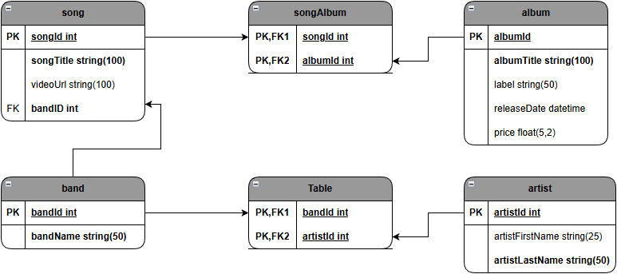

# 动手练习：向黑胶唱片商店数据库添加数据

目标：
- 向黑胶唱片商店数据库添加数据；
- 描述一个普通文件和一个 CSV 文件；
- 使用 INSERT 手动向数据库添加数据；
- 解释从 CSV 文件导入数据之前需要做什么；
- 现将有文件中的数据导入数据库；
- 创建一个脚本将数据加载到数据库中。

## 组织表

执行 vinylrecordshop.sql 脚本

数据文件的压缩包保存在名为 vinylrecordshop-data.zip 内



主要表：
- band
- album
- artist

其他三个表至少包括一个外键列：
- song 引用了 band
- bandArtist 引用了 band 和 artist
- songAlbum 引用了 song 和 album

为确保与外键相关的任意一个主键在它的相同值被用作外键前都有数据，必须在创建 songAlbum 表前创建 song 表。

## 创建脚本文件

在脚本文件中，在第一行添加注释为你的姓名，在第二行添加注释为当前日期。脚本文件用于同时重建结构和重置数据或者将 INSERT 语句添加到现有的 schema 脚本中。

## 插入数据

向数据库添加数据的两种方式：
- 手动输入每条记录
- 从平面文件（Excel工作表、.csv文件）导入数据

### 平面文件

csv（comma-separated values）逗号分隔的值

### 通过 SQL 插入数据

对于 album 表：
- 列在数据集中出现的顺序与在表中出现的顺序不同。当将数据从数据集添加到表中时要注意。
- 数据集的日期格式为 m/d/yyyy，MySQL 默认日期格式为 yyyy-mm-dd

按照建表时列的顺序插入值。

```sql
/*
 *  尽管 albumId 列设置为记录添加到表中时自动编号，因为没有列名，故在这个语句中必须包括一个值。
 *  如果省略 albumId 的值，则 MySQL 认为 "Imagine" 应放在第一个列中，并抛出一个错误。
 *  
 *  添加到数据库中的字符串值都包括在引号中：字符串必须使用引号括起来，可使用单引号或双引号，成对出现。
 *  
 *  日期必须按照 "yyyy-mm-dd" 的预定格式出现，否则将无法识别为日期。日期必须用引号括起来，和字符串值一样。
 *  MySQL 使用以下的日期格式都有效：
 *  "2023-01-09"、"2023-01-9"、"2023-1-09"、"2023-1-9"
 * */
INSERT INTO album
VALUES (1, 'Imagine', 'Apple', '1971-9-9', 9.99);
```

在添加数据时使用列名称

```sql
/*
albumId 没有包括在列的列表中，因为 albumId 是主键，且没有包括在列表中，MySQL 自动为其编号。

*/
INSERT INTO album (albumTitle, releaseDate, price, label)
VALUES ('2525 (Exordium & Terminus)', '1969-7-1', 25.99, 'RCA');

-- 查看添加结果
SELECT * FROM album;

-- 在一个语句中添加多条记录
/*
 *  没有提供 albumId 的值，所以，允许数据库引擎自动对记录进行编号；
 *  每行用 ROW 关键字标识、用逗号分隔。可使用相同的模式包括任意数量的行；
 *  专辑标题 “No One's Gonna Change Our World” 包括了一个单引号作为所有格标记。（该值本身必须位于双引号内）
 * */
INSERT INTO album (albumTitle, releaseDate, price, label)
VALUES 
ROW ("No One's Gonna Change Our World", '1969-12-12', 39.95, 'Regal Starline'),
ROW ('Moondance Studio Album', '1969-8-1', 14.99, 'Warner Bros');
```

自己动手插入数据

```sql
INSERT INTO album (albumTitle, releaseDate, price, label)
VALUES 
ROW ("Clouds", '1969-5-1', 9.99, 'Reprise'),
ROW ("Sounds of Silence Studio Album", '1966-1-17', 9.99, 'Columbia'),
ROW ("Abbey Road", '1969-1-10', 12.99, 'Apple'),
ROW ("Smiley Smile", '1967-9-18', 5.99, 'Capitol');
```

### 更新记录

```sql
-- 删除其中一条记录
DELETE FROM album
WHERE albumId = 5;

-- 将删除的记录重新添加到数据库中
INSERT INTO album (albumTitle, releaseDate, price, label)
VALUES ("Clouds", '1969-5-1', 9.99, 'Reprise');

SELECT * FROM album;
/*
 *  albumId 为 9，不是缺失值 5。
 * */
```

```sql
-- 14-1 更新 albumID：将 Clouds 的 albumId 更改为 5
USE vinylrecordshop;

UPDATE album
    SET albumId = 5
WHERE albumTitle = 'Clouds';
```

```sql
-- 14-2 更新 Smiley Smile 的 albumId
USE vinylrecordshop;
UPDATE album
    SET albumId = 9
WHERE albumTitle = 'Smiley Smile';
```

## 导入CSV 数据

将 .csv 文件导入数据库 MySQL 前，须要检查：
- 从 .csv 文件中删除标题行（如果存在）
- 验证源文件是否包括与目标 MySQL 表相同的列；
- 验证源文件中的列是否与表中的列的顺序一致；
- 验证 .csv 文件中的所有列是否与 MySQL 中定义的数据类型兼容。

### 设置 MySQL

默认情况下，MySQL 阻止用户从外部文件导入数据，需要更改配置。

在命令提示符窗口设置如下：
```txt
1. 切换到 C:\Program Files\MySQL\MySQL Server 8.4\bin 目录下；
2. 执行命令登录root账户 "mysql -u root -p" 回车并输入密码
3. 执行命令设置全局变量 "SET GLOBAL local_infile=1;"
4. 执行命令退出当前服务器 "quit"
5. 附带 local-infile 重新连接服务器 "mysql --local-infile=1 -u root -p" 回车并输入密码
```
[ERROR: Loading local data is disabled - this must be enabled on both the client and server sides](https://stackoverflow.com/questions/59993844/error-loading-local-data-is-disabled-this-must-be-enabled-on-both-the-client)

### 准备 CSV 文件

- 使用 Excel 打开 artist.csv 文件，删除包含列名的标题行（第一行）。
- 本例中，名和姓颠倒了，需要调换一下：
(1) 右击 first name 列上方的字母 C
(2) 单击上下文菜单中的 Cut（剪切）
(3) 右击 last name 列上方的字母 B
(4) 单击上下文菜单中的 Insert Cut Cell（插入剪切的单元格）
- isHallOfFame 列中的 TRUE 用 1 替换，FALSE 用 0 替换。

### 导入文件

使用命令行导入

```sql
-- 14-3 删除 artist 表中的记录
USE vinylrecordshop;
DELETE FROM artist WHERE artistId < 30;
```

```sql
-- 14-4 载入 artist.csv 文件
/*
 *  LOCAL INFILE 通知 MySQL 在本地文件中查找数据；
 *
 *  表名被限定为包括数据库名：vinylrecordshop.artist 确保数据加载到正确的表中；
 *
 *  指定该文件使用逗号对数值进行分隔。
 * */
LOAD DATA LOCAL INFILE 'C:/Users/user/Documents/artist.csv'
INTO TABLE vinylrecordshop.artist
FIELDS TERMINATED BY ',';

-- 查看结果
SELECT * FROM artist;
```

使用 MySQL Workbench 导入数据（略）

## 向脚本中添加数据

查找并打开导出的 .sql 文件：
1. 用 cd 命令打开 MySQL 安装的 bin 子目录（如：C:\Program Files\MySQL\MySQL Server 8.4\bin）；
2. 在这个子目录的命令行中运行mysqldump，语法为：mysqldump -p --user=root database table > destination_filepath。（如，mysqldump -p --user=root database table > C:/User/user/Documents/artist.sql）；
3. 找到 INSERT INTO 语句，将其复制并粘贴到现有的 vinylrecordshop-data.sql 文件的末尾。

## 测试脚本（略）

## 总结黑胶唱片商店的脚本

**向相关表添加数据前，必须现在主要表中添加数据。**

在确定正确地为每个表导入数据后，将该表的 IMPORT 语句保存到数据脚本中。

## 小结

- 重建数据库的脚本：
    - 通过删除数据库和重建所有表来创建数据库；
    - 向这些表添加数据。

- 创建用于重建数据库的脚本时，要遵循的规则：
    - 添加数据前，必须创建用于存储数据的结构；
    - 创建相关表前，必须先创建主要表。如果相关表的主键列尚不存在，则参照完整性将阻止你创建外键列；
    - 向相关表添加数据前，必须先向主要表添加数据。如果该值在相关联的主键列不存在，则参照完整性将阻止你使用这个值作为外键。