# 创建实体-关系图

目标：

- 创建一个ERD，其中包括在数据库规范化过程结束时确定的表、列和关系；
- 在ERD中包含有关数据库组件的适当元数据，包括主键、外键、数据类型和各个字段的可空性。

## 使用 ERD

使用 ERD 的主要目的：确保数据库结构正确。
创建ERD（数据库结构的可视化表示）的优点：

- 有助于确定建议的结构可能不适用的地方。
- 允许团队查看数据库的结构，有助于每个团队成员快速确定哪些列在哪个表中以及表之间的关系。
- 提供了数据结构的单一、精简表示，有助于更快编写SQL语句，尤其是当SQL语句引用两个或多个表时。

常用工具：

- Draw.io: 基于 Chrome 的免费工具。
- ERDPlus: 专门用于绘制 ERD 和类似的数据库结构的免费工具。[ERDPlus](https://erdplus.com/trial)

## ERD 组件

一个设计良好的ERD应包括：

- 数据库所需的表（实体），包括每个表的名称；
- 每个表中的所有列；
- 关于每个列的元数据，包括列的名称、数据类型及是否为空；
- 所有主键列和外键列的标识；
- 每个表是如何相互关联的。

可以访问样本数据集来确定 ERD 应该包括哪些列，以及每个列的合适数据类型。
在构建 ERD 时，还需要定义用于对象的命名约定。确保所有对象都是用这些命名约定。
命名规则：单数名词、复数名词。表名一般使用单数名词。

### 创建表

表用矩形表示。
表的三部分：名称、主键列、其他列

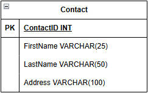

### 添加列

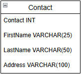

为列名设置数据类型和空间大小

- ContactID：一个必需的代理键，数据类型为整数（INT）
- FirstName 和 LastName：和人名相关的列都是必需的，数据类型为字符串。因长度不固定，数据类型设置为 VARCHAR。FirstName 设为 25，LastName 设为 50。
- Address：一个可选列。数据类型为 VARCHAR，长度为 100。

### 添加键标识符

指示主键和外键：通过在表中适当列名称的左侧分别添加 PK 和 FK。为了使主键或其他必须保持唯一的列突出，对这些列的名称使用下划线。

将 ContactID 设置为主键

### 加入其他表

PhoneType 用于存储电话类型的名称，其数据类型是字符类型。

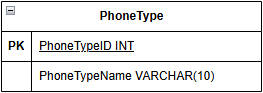

Phone 用于存储电话号码。

电话号码被视为字符串而不是数字，因为：

- 不会对电话号码进行数学运算，所以不需要将其存储为数字；
- 电话号码可以包含非数字字符，如字母或破折号

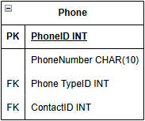

### 显示关系

表示两个表之间最简单的方法：用一个带有方向的箭头从关系的一侧指向关系的多侧。本例中，每个联系人可以有多个电话号码，但每个电话号码只属于一个人。箭头从Contact表指向Phone表。

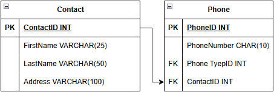

在关系的“多”端添加了一个鱼尾纹标记：表示Contact表的任何记录都可以与Phone表中的“多”个记录相关联（一个联系人可以有多个电话类型）。

在Contact侧有一个小垂直线：表示Phone表中的每条记录必须只有一个相关的记录在Contact表中。（每个联系人至少有一个电话号码）。

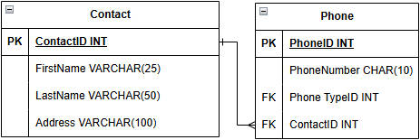

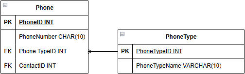

ERD 关系符号

|                          样式                          |      关系      |
| :-----------------------------------------------------: | :------------: |
|            |     一对一     |
|    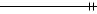    |    强制单一    |
| 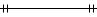 |   强制一对一   |
|           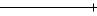           |       一       |
|     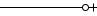     |     零对一     |
| 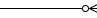 | 零对多（可选） |
|     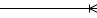     |     一对多     |
|           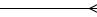           |       多       |

## 数据库的ERD

**注意这个视图如何允许在单个视图中同时查看所有表的所有列，并标识表之间的连接关系。**

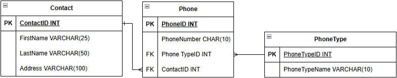

## 多对多关系

在开始使用未规范化的一组数据时，通常会在将数据规范化为所需表的过程中识别出许多表之间的多对多关系。在规范化数据库（至少2NF）中，所有关系都是一对一关系或一对多关系。

**一个多对多的关系必须包括三个单独的表：两个原始表和一个桥表。多数情况下，原始表的主键列用于创建桥表的主键，此时有多个列既是外键又是主键的一部分。**

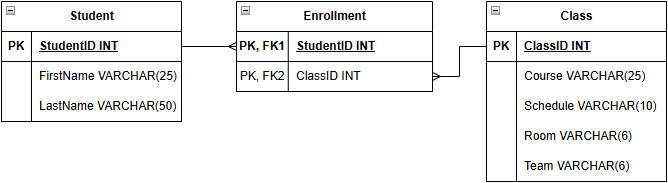

## 小结

- 实体-关系图是关系数据库设计的重要工具，他们提供了对数据库结构的可视化。
- 任何 ERD 都应提供识别数据库结构所需的基本信息：
  - 表的名称
  - 列的名称
  - 作为键的列
  - 表之间的关系
- [ERD 的更多信息及其他符号和布局选项的示例](https://www.lucidchart.com/pages/er-diagrams)
