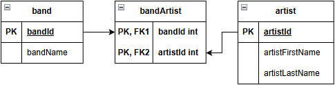
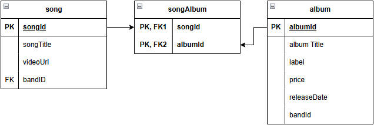
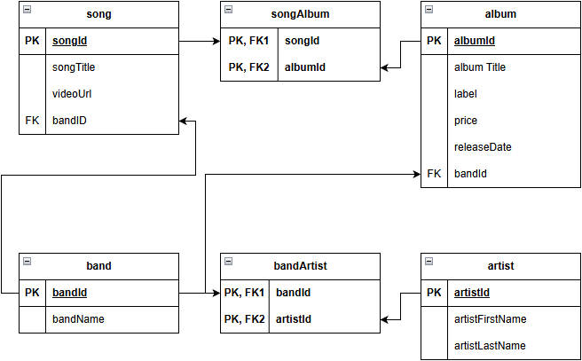
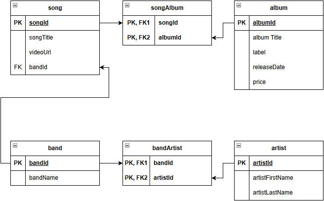
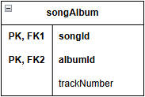
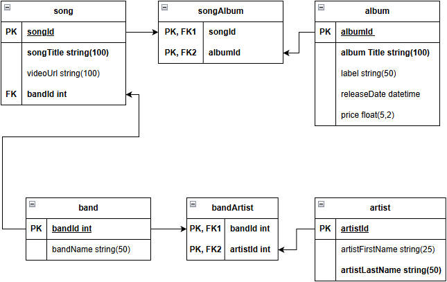

# 动手练习：规范化黑胶唱片商店数据库

目标：
- 确定数据库的列；
- 确定每个列的适当数据类型；
- 将数据标准化为第三范式；
- 创建数据库的ERD。

## 黑胶唱片商店数据概览

数据库将支持以下内容：

（1）对于数据库中的每张专辑，包含：
- 专辑中的歌曲列表
- 乐队名称或在专辑中演出的艺术家的名字
- 专辑标签的名称
- 专辑的价格
- 专辑最初的发行日期

（2）对于数据库中的每首歌曲，包含：
- 歌曲标题
- 歌曲的演唱者或乐队
- 这首歌视频的URL
- 这首歌首次出现的专辑

（3）对于每个乐队，包含：
- 乐队中的名称
- 乐队中艺术家的名字

（4）对于每位艺术家，包含：
- 艺术家的名字

## 第1步：识别实体和属性

第1步是通过对数据库的描述来识别数据库中包含的实体，以及这些实体的属性。

第1步的结果：

**album**
- title
- song
- band/artist
- label
- price
- release date

**song**
- title
- videoUrl
- album
- band/artist

**band**
- name
- artist

**artist**
- name

每个实体的名称使用的是单数名词，这是用于数据库的命名约定的一部分。所有列名和数据类型在流程结束时最终确定。

这一步的重点：创建数据库最终包含内容的大致概述。

## 第2步：1NF

保证每个实体都符合 1NF
- 每一行都可以唯一标识；
- 每行与每列的交集（单元格）只包含一个值；

将每个实体都放在 1NF，需要完成：
1. 确保每个实体都包含一个或一组可以充当主键的列；
2. 识别现有实体中可能包含多个值的任何列，并为每个列创建一个单独的实体；
3. 重复步骤1和步骤2，直到每个实体都满足 1NF。
    - 在“行”中，无需满足从上到下的顺序；
    - 在“列”中，无需满足从左到右的顺序；
    - 每行都可以被唯一标识；
    - 每行与每列的交集（单元格）只包含一个值。

### 确定主键

在现有实体中没有特别合适的候选键。 videoUrl 可以作为 song 的主键，但每首歌只能有一个 URL，而实际上大多数歌曲都有多个URL，并且一个给定的 URL 可能会打开多首歌曲的播放列表。
为每个实体创建代理键，更新后的列表：

**album**
- albumId(PK)
- title
- song
- band/artist
- label
- price
- release date

**song**
- songId(PK)
- title
- videoUrl
- album
- band/artist

**band**
- bandId(PK)
- name
- artist

**artist**
- artistId(PK)
- name

### 解析带有多个值的列

处理可能有多个值的列。

对 artist 表的 name 修改为 artistFirstName 和 artistLastName

**artist**
- artistId(PK)
- artistFirstName
- artistLastName

将艺术家数据需要放在一个单独的实体中，还需要为乐队名称属性指定一个更具描述性的名称。

**band**
- bandId(PK)
- name
- artistId(FK)

艺术家与乐队之间的关系，假设如下：

- 乐队成员不会改变；
- 任何乐队都至少有一个成员，但大多数乐队都有多个成员；
- 任何艺术家都可以加入多个乐队。
  **意味着艺术家和乐队存在多对多的关系，任何一个实体的主键被放入另一个实体中，都违反 1NF。那么需要创建一个桥接实体。将两个实体的主键作为自己的主键。**这样就会产生以下实体：

**band**
- bandId(PK)
- bandName

**bandArtist**
- bandId(PK, FK)
- artistId(PK, FK)

**artist**
- artistId(PK)
- artistFirstName
- artistLastName

### 规范化歌曲（song）实体

当前歌曲实体：

**song**
- songId(PK)
- title
- videoUrl
- album
- band/artist

重命名 title，从而与专辑名称相区别。如果认为单独的艺术家是一个乐队，则 bandId 将被添加为歌曲实体的外键。

**song**
- songId(PK)
- songTitle
- videoUrl
- album
- bandId(FK)

当前专辑实体：

**album**
- albumId(PK)
- title
- song
- band/artist
- label
- price
- releaseDate

绝大多数专辑都包含多首歌曲，假设每张专辑只有一个乐队或艺术家的假设。可以将 bandId 替换这个列作为外键，并更新 title 属性及专门引用专辑。更新后的专辑实体如下：

**album**
- albumId(PK)
- albumTitle
- label
- price
- releaseDate
- bandId(FK)

任何歌曲都可以出现在多张专辑中，大多数专辑都包含多首歌曲，即存在多对多关系。将专辑从歌曲中提取出来，或将歌曲从专辑提取出来来创建桥接表。
**song**
- songId(PK)
- songTitle
- videoUrl
- bandId(FK)

**songAlbum**
- sougId(PK, FK)
- albumId(PK, FK)

**album**
- albumId(PK)
- albumTitle
- label
- price
- releaseDate
- bandId(FK)

### 第2步的结果

**band**
- bandId(PK)
- bandName

**bandArtist**
- bandId(PK, FK)
- artistId(PK, FK)

**artist**
- artistId(PK)
- artistFirstName
- artistLastName

**song**
- songId(PK)
- songTitle
- videoUrl
- bandId(FK)

**songAlbum**
- sougId(PK, FK)
- albumId(PK, FK)

**album**
- albumId(PK)
- albumTitle
- label
- price
- releaseDate
- bandId(FK)

将所有实体与满足1NF的4个条件清单进行对照：
- 每个实体都有一个主键；
- 每个实体中的每个属性都有一个值。

## 第3步：2NF

2NF的主要要求：
- 所有实体都满足 1NF;
- 没有列，部分依赖于主键。

第3步的结果：
2NF只适用于具有复合键的实体。

**bandArtist**
- bandId(PK, FK)
- artistId(PK, FK)

**songAlbum**
- songId(PK, FK)
- albumId(PK, FK)

## 第4步：3NF

3NF：所有实体都满足2NF（以及扩展的1NF），并且没有非键列依赖于其他非键列。

### 第4步的结果

两个桥接实体（songAlbum 和 bandArtist）都只包含键列

观察乐队和艺术家实体：

**band**
- bandId(PK)
- bandName

**artist**
- artistId(PK)
- artistFirstName
- artistLastName

乐队和艺术家实体不需要更改就满足 3NF，因为名称取决于实体描述的乐队或艺术家。

观察歌曲和专辑实体：

**song**
- songId(PK)
- songTitle
- videoUrl
- bandId(FK)

**album**
- albumId(PK)
- albumTitle
- label
- price
- releaseDate
- bandId(FK)

对于歌曲实体：songTitle 和 videoUrl 取决于歌曲；
对于专辑实体：albumTitle、label、price 和 releaseDate 取决于专辑。
bandId必须是桥接实体 bandArtist 的外键，但它需要描述乐队、歌曲和专辑之间的关系。

### 3NF 的 ERD

专辑实体不需要 bandId。

**band**
- bandId(PK)
- bandName

**artist**
- artistId(PK)
- artistFirstName
- artistLastName

**song**
- songId(PK)
- songTitle
- videoUrl
- bandId(FK)

**album**
- albumId(PK)
- albumTitle
- label
- releaseDate
- price

**bandArtist**
- bandId(PK, FK)
- artistId(PK, FK)

**songAlbum**
- songId(PK, FK)
- albumId(PK, FK)

## 第5步：确定最终结构

每次更改后，尤其接近初始设计步骤的尾声，回到现有实体中使用1NF重新开始，确保最终设计满足数据库的需求。

再次查看最终的设计，数据库处于1NF状态：每个实体都有一个主键，每个属性只存储一个值。数据库也满足2NF，唯一具有复合键的实体是songAlbum和bandArtist，它们都不包含非键属性。3NF，每个属性只描述所在的实体，并依赖于该实体的主键。

跟踪特定专辑的每首歌曲的曲目号，因曲目号取决于歌曲和所属专辑，所以可在 songAlbum 中添加一个非键字段。

## 最后一步

确定每个实体中每个属性的泛型数据类型。构建表时，将其转换为特定的数据类型。还可以确定定义每个表所需的属性。

本例中，考虑：
- 已经确定了表的命名约定（驼峰式的单数命名），对列名使用相同的约定；
- 所有主键都是整数；
- 必填字段以粗体显示；
- 非键的数据类型可以是字符串、日期、数字，取决于列要保存的数据；
- 为字符串列设置了最大字段大小；
- 将艺术家的名字分成名和姓。

数据库最终版本（以列表的方式表示）：

**band**
- bandId(PK) int
- bandName string(50)

**artist**
- artistId(PK)
- artistFirstName string(25)
- artistLastName string(50)

**song**
- songId(PK) int
- songTitle string(100)
- videoUrl string(100)
- bandId(FK) int

**album**
- albumId(PK) int
- albumTitle string(100)
- label string(50)
- releaseDate datetime
- price float(5,2)

**bandArtist**
- bandId(PK, FK) int
- artistId(PK, FK) int

**songAlbum**
- songId(PK, FK) int
- albumId(PK, FK) int

## 小结
- 了解如何构建数据库设计的过程：使用一个包含4个独立实体（专辑、歌曲、乐队和艺术家）的数据库，并对这些属性进行规范化处理。

