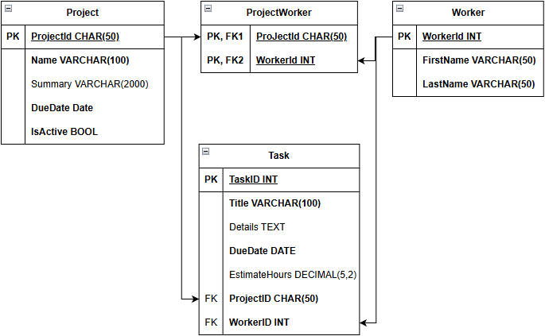
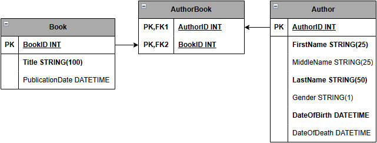

# 应用CRUD:基本数据管理与操作

目标：
- 使用 SQL 在关系数据库中的现有表中创建新数据；
- 从数据库中检索现有的数据；
- 更新关系数据库中的现有数据；
- 从关系数据库中删除数据。

## 数据操作语言

CRUD：
- 创建（creating）
- 检索（retrieving）
- 更新（updating）
- 删除（deleting）

## 创建数据库



```sql
-- 9-1 用于创建 TrackIt 数据库的 SQL 脚本
DROP DATABASE IF EXISTS TrackIt;
CREATE DATABASE TrackIt;
-- 在添加模式前，请确保我们已经处于正确的数据库中。
USE TrackIt;

/*
 *  WorkerId 和 TaskId 被设置为自动递增的整数列。
 *  当数据被添加到 Worker 表和 Task 表时，MySQL 将自动为这些列分配值。
 *  
 *  ProjectId 是一个 CHAR(50) 列。便于使用有意义的值（如，db-milestone）来标识项目。
 *  在这种情况下使用整数也可以，但因每个项目名称都是唯一的，可将ProjectId定义为一个字符串，
 *  其中每个项目都具有唯一的 ProjectId （项目名称）。
 *
 *  当主键只包括一个列时，可将其作为列定义的一部分来定义表的主键：
 *  WorkerId INT PRIMARY KEY AUTO_INCREMENT
 *  
 *  当存在复合键时，必须使用不同的格式。复合键由多个列组成的键。
 *  必须使用单独的 PRIMARY KEY 定义，其中，包括所有适当的列。
 *  ProjectWorker 表充当 Project 和 Worker 之间的桥接表，
 *  因为每个项目可以有多个工作者，而每个工作者可以分配到多个项目。
 *  创建主键：PRIMARY KEY pk_ProjectWorker (ProjectId, WorkerId)
 *  
 *  在项目（Project）表中，布尔列 IsActive 的默认值为 1。
 *  IsActive BOOL NOT NULL DEFAULT 1
 *  意味着，当没有指定一个值，MySQL 将自动在每个新纪录中设置默认值。
 * */

CREATE TABLE Project (
    ProjectId CHAR(50) PRIMARY KEY,
    ProjectName VARCHAR(100) NOT NULL,
    Summary VARCHAR(2000) NULL,
    DueDate DATE NOT NULL,
    IsActive BOOL NOT NULL DEFAULT 1
);

CREATE TABLE Worker (
    WorkerId INT PRIMARY KEY AUTO_INCREMENT,
    FirstName VARCHAR(50) NOT NULL,
    LastName VARCHAR(50) NOT NULL
);

CREATE TABLE ProjectWorker (
    ProjectId CHAR(50) NOT NULL,
    WorkerId INT NOT NULL,
    PRIMARY KEY pk_ProjectWorker (ProjectId, WorkerId),
    FOREIGN KEY fk_ProjectWorker_Project (ProjectId)
        REFERENCES Project(ProjectId),
    FOREIGN KEY fk_ProjectWoker_Worker (WorkerId)
        REFERENCES Worker(WorkerId)
);

CREATE TABLE Task (
    TaskId INT PRIMARY KEY AUTO_INCREMENT,
    Title VARCHAR(100) NOT NULL,
    Details TEXT NULL,
    DueDate DATE NOT NULL,
    EstimateHours DECIMAL(5, 2) NULL,
    ProjectId CHAR(50) NOT NULL,
    WorkerId INT NOT NULL,
    FOREIGN KEY fk_Task_ProjectWorker (ProjectId, WorkerId)
        REFERENCES ProjectWorker(ProjectId, WorkerId)
);

```

### 构建数据库

### 检查数据库是否存在

```sql
/*
 *   创建数据库后，执行以下步骤，确保脚本按预期工作：
 * */
-- (1) 显示可用的数据库列表
SHOW DATABASES;
-- (2) 确保你正在使用新的数据库
USE Trackit;
-- (3) 检查数据库是否包括适当的表
SHOW TABLES;
```

## 插入数据

```sql
-- 插入数据的基本结构：（方括号表示一个可选子句）
INSERT INTO  TableName [( column list... )]
    VALUES ( value list... );
```

### 插入数据时，不给出列的名称

使用 INSERT 语句向表中添加值，无需明确指定要添加值得列。RDBMS 将按照表中列出现的相同顺序，从左到右，将每个值映射到现有列。

```sql
-- 假设有一个包括 SandwichName、Cheese、IsFried 列的表，顺序如上所述，使用以下语句添加一行数据
INSERT INTO Sandwich VALUES ('Monte Cristo'， 'Emmental', 1);
-- 必须为表中的每个列提供一个值或指定一个空值，除了自动递增的列。如果 Cheese 为空：
INSERT INTO Sandwich VALUES ('PB&J', '', 0);
-- 对于其他数据类型，在空位置之前和之后使用逗号，但不要在逗号之间包括任何内容。如 'value1',, 'value3'
```

### 插入数据时，给出列的名称

同时给出列名和值。RDBMS 按照 INSERT 语句中显示的相同顺序，将每个列与每个值进行映射，即使这与表中列出的顺序不同。

```sql
INSERT INTO Sandwich (SandwichName, Cheese, IsFried)
    VALUES ('Monte Cristo'， 'Emmental', 1);
```

无论表中的列定义的顺序如何，此语句都可运行。但如果给出了某个列名，则必须在值列表中为该列提供一个值或指定一个空值。

### 更好的选择

编写 INSERT 语句时，要考虑：
- 该表中是否有自动递增的列；
    如果省略自动递增的列的值，则数据库引擎将生成该值。如果给出一个值，MySQL允许在没有保护的情况下进行插入操作。**其他数据库会禁用在自动递增功能之前阻止插入操作。**
- 哪些列允许出现空值；
    - 如果某个列被定义为 NOT NULL 且没有默认值，则必须在 INSERT 语句中提供一个值；
    - 如果某个列为外键，则提供的任何值必须已存在于相关的主表中；
    - 如果该列可以为空，则可以选择在添加数据时忽略这些值；
    - 如果该列不可为空，则必须提供一个允许的值。
- 是否有外键列；
- 外键值是否可以为空。

```sql
/*
 *  在 ProjectWorker 表中，ProjectId 和 WorkerId 都必须设置为存在于 Project 表和 Worker 表中的值。
 *  若这些值在相关表中不存在，则插入操作将失败，因为需要满足参照完整性。
 *  由于这些值不可为空，则必须提供一个值，否则插入操作因违反约束而失败。
 * */

/*
 *  将一个 Worker 添加到表中：
 *  如果 WorkerId = 1 不存在，Rosemonde 将会被插入而不会出现错误，并且会对其 WorkerId 赋值 1。
 *  插入成功后，将显示 “1 row(s) affected.”
 *  如果再次运行该语句，则会报错，如“Error Code: 1062. Duplicate entry '1' for key 'PRIMARY'.”
 *  因为同一表中两条记录不能具有相同的主键值。
 * */
INSERT INTO Worker (WorkerId, FirstName, LastName)
    VALUES (1, 'Rosemonde', 'Featherbie');

-- 因为 WorkerId 已经设置了自动递增，所以不需要包括该列的值。
INSERT INTO Worker (FirstName, LastName)
    VALUES ('Kingsly', 'Besantie');

-- 查看表的内容
SELECT * 
FROM Worker;
```

### 一次插入多条记录

使用一条查询插入多条记录，需要用逗号将两个或多个值列表分隔开，包括括号。

```sql
-- WorkerId 自动递增
INSERT INTO Worker (FirstName, LastName) VALUES
    ('Goldi', 'Pilipets'),
    ('Dorey', 'Rulf'),
    ('Panchito', 'Ashtonhurst');

-- 查看表的内容
SELECT *
FROM Worker;
```

### 不按顺序增加自动递增值

当插入的 WorkerId 值高于下一个自动递增值时：

```sql
-- 使用 WorkerId=50 添加一条新记录
INSERT INTO Worker (WorkerId, FirstName, LastName)
    VALUES (50, 'Valentino', 'Newvill');

-- 不指定 WorkerId
INSERT INTO Worker (FirstName, LastName)
    VALUES ('Violet', 'Mercado');

-- 查看表的内容
SELECT *
FROM Worker;
```

### 插入外键

```sql
-- 在 Project 表中添加一条记录
/*
 *  ProjectId：被分配的而非自动生成的，必须指定数值
 *  Summary：可以为空，列名和值可以安全地省略
 *  IsActive：默认值是1，如果默认值适用，则可以省略列名和值
 * */
INSERT INTO Project (ProjectId, ProjectName, DueDate)
    VALUES ('db-milestone', 'Database Material', '2022-12-31');

-- 将一个 Worker 分配给一个 Project，需向 ProjectWorker 表中插入数值。
/*
 *  因 Worker 表中不存在 WorkerId 为 75 的记录，所以数据库引擎报错。
 *  将 WorkerId 的值从 75 更改为 2 就可以运行。
 * */
INSERT INTO ProjectWorker (ProjectId, WorkerId)
    VALUES ('db-milestone', 75);

-- 添加第二个项目病分配工人
INSERT INTO Project (ProjectId, ProjectName, DueDate)
    VALUES ('kitchen', 'Kitchen Remodel', '2025-07-15');

INSERT INTO ProjectWorker (ProjectId, WorkerId) VALUES
    ('db-milestone', 1),    -- Rosemond, Database
    ('kitchen', 2),         -- Kingsly, Kitchen
    ('db-milestone', 3),    -- Goldi, Database
    ('db-milestone', 4);    -- Dorey, Database

-- 查看结果
SELECT *
FROM Project;

SELECT *
FROM ProjectWorker;
```

## 更新数据

```sql
-- UPDATE 语句用于更改表中的记录值，其基本结构：
UPDATE TableName SET
    Column1 = [Value1],
    Column2 = [Value2],
    ColumnN = [ValueN]
WHERE [Condition];
```

注意：
- UPDATE 语句将更改限制在指定的表中；
- 在 SET 关键字之后，通过逗号分隔，可以给一个或多个列赋予值；
- [Value] 可以是一个字面值、另一个列，甚至是一个查询的结果；
- WHERE [Condition] 子句是一个布尔表达式，可以使用 AND 、OR 或任何布尔运算符以任何组合来限制需要更改的记录。

### 更新一行

因主键值对于表中的每一行都是唯一的，故可使用 WHERE 子句来指定只影响特定行的主键值。

```sql
-- 9-2 更新行：使用 UPDATE 语句向 Project 表添加信息，及向 Worker 表添加姓氏。
-- 更改项目摘要和截止日期
UPDATE Project SET
    Summary = 'All lessons and exercises for the relational database milestone.',
    DueDate = '2023-10-15'
WHERE ProjectId = 'db-milestone';

-- 将 Kingsly 的姓氏改为 Oaks。
UPDATE Worker SET
LastName = 'Oaks'
WHERE WorkerId = 2;
```

### 在更新之前进行预览

**估计受影响的行数，并确保 WHERE条件是正确的。在 SQL 中没有“撤销”操作**

```sql
-- 9-3 预览即将更改的记录
SELECT *
    FROM Project
    WHERE ProjectId = 'db-milestone';

SELECT *
    FROM Worker
    WHERE WorkerId = 2;
```

### 更新多条记录

如果 WHERE 子句没有使用主键或选择了一个值范围，则它可以捕获多行。

```sql
UPDATE ProjectWorker SET 
    WorkerId = '5'
WHERE WorkerId = 2;
```

### 禁用 SQL_SAFE_UPDATES

如果要更新表中的所有行，需省略 WHERE 子句。
某些 MySQL 实例配置为阻止没有 WHERE 子句的 UPDATE 操作，可使用语句禁用安全更新配置。更新完成后，再重新启用安全更新。

```sql
-- 9-4 禁用 SQL_SAFE_UPDATES
-- 禁用安全更新
SET SQL_SAFE_UPDATES = 0;

-- 将 2022 年活动的项目设置为非活动
UPDATE Project SET
    IsActive = 0
WHERE DueDate BETWEEN '2022-01-01'
AND '2022-12-31'
AND IsActive = 1;

-- 启动安全更新
SET SQL_SAFE_UPDATES = 1;

-- 根据列值进行更新：
-- 将 Kingsly 的所有任务估计时间增加 25%
UPDATE Task SET 
EstimatedHours = EstimateHours * 1.25
WHERE WorkerId = 2;
```

## 删除数据

```sql
-- 删除语句的基本结构：
DELETE FROM TableName 
WHERE [Condition];
```

注意：
- DELETE FROM TableName 只删除指定表中的数据；
- WHERE [Condition] 求值结果是一个布尔值。

删除操作要么删除整行，要么不删任何内容。如果想删除记录中的几个值，可以使用 UPDATE 语句将这些值设置为 null（假设可以为空）。

最好在 DELETE 语句的 WHERE 子句中使用主键值来识别特定的记录。如果删除操作按预期进行，则将会显示一个确认消息，指示受影响的行数为 1，并且该行不再出现在表中。

```sql
-- 9-5 禁用 SQL_SAFE_UPDATES 以执行删除
-- Safe updates also prevent DELETE.
/*
 *  期望删除该行，但是参照完整性发挥了作用：
 *  如果真的想在 Worker 表中删除工人 Panchito，必须首先删除相关表中引用了 Worker 表的主键的所有记录。
 * */
SET SQL_SAFE_UPDATES = 0;
DELETE FROM Worker
WHERE WorkerId = 5;
SET SQL_SAFE_UPDATES = 1;
```

```sql
-- 9-6 删除工人 Panchito

-- 在代码执行时，先关闭 SQL_SAFE_UPDATES。
SET SQL_SAFE_UPDATES = 0;

-- 首先删除 Task 表中所有该工人对应的任务，因为 Task 表引用了 ProjectWorker
DELETE FROM Task
WHERE WorkerId = 5;

-- 接下来删除 ProjectWorker 中的记录，将 Panchito 从所有项目中删除
DELETE FROM ProjectWorker
WHERE WorkerId = 5;

-- 最后，删除 Panchito
DELETE FROM Worker
WHERE WorkerId - 5;

-- 在代码执行完毕后，重新打开 SQL_SAFE_UPDATES。
SET SQL_SAFE_UPDATES = 1;
```

```sql
-- 9-7 确认表中的内容：验证数据是否已被删除
SELECT *
FROM Task;

SELECT *
FROM ProjectWorker;

SELECT *
FROM Worker;
```

## 小结

- DML 提供了4个命令：
    - SELECT 从一个或多个表中读取数据
    - INSERT 向表中添加行
    - UPDATE 更改一行或多行
    - DELETE 删除一行或多行
- **SQL 没有撤销命令**

## 本课练习

### 练习 9-1：设置图书列表
在练习 7-1 中，你创建了一个名为 Books 的数据库。该数据库的一部分如图 9-2 所示。此版本包含一个 Book 表，其中，包括书名、出版日期和书籍 ID。还有一个用于列出作者姓名及其他描述性信息的表。如果你没有创建在练习 7-1 中所介绍的大型数据库，那么现在请创建一个脚本来构建这个较小的版本。



数据库创建完成后，请将如下记录添加到数据库中。

(1) 向 Book 表中添加至少 10 本书。其中，包括以下 5 本：

- 《了不起的盖茨比》（Great Gatsby），出版日期为 1925 年 4 月 10 日。
- 《1984》（1984），出版日期为 1949 年 6 月 8 日。
- 《傲慢与偏见》（Pride and Prejudice），出版日期为 1813 年 1 月 28 日。
- 《霍比特人》（The Hobbit），出版日期为 1937 年 9 月 21 日。
- 《爸爸笑话：逗你的孩子开心》（Dad Jokes: Getting Your Kids to Laugh），出版日期为 2020 年 12 月 2 日。

(2) 除了你添加的书籍的作者以外，还添加以下作者：

- F.Scott Fitzgerald，出生于 1896 年 9 月 24 日，逝世于 1940 年 12 月 21 日，是《了不起的盖茨比》的作者。
- George Orwell，出生于 1903 年 6 月 25 日，逝世于 1950 年 1 月 21 日，是《1984》的作者。
- Jane Austen，出生于 1775 年 12 月 6 日，逝世于 1817 年 1 月 21 日，是《傲慢与偏见》的作者。
- J.R.R. Tolkien，出生于 1892 年 1 月 3 日，是《霍比特人》的作者。
- Bradley Jones,出生于 1999 年 8 月 11 日，是《爸爸笑话：都你的孩子开心》的作者。

### 练习 9-2：更新图书
使用你在练习 9-1 中创建的数据库和表。不要添加新数据，而是对现有记录进行以下更新：

- 将书名 Great Gatsby 更改为 The Greate Gatsby。
- 将 J.R.R. Tolkein 的去世日期更改为 1973 年 9 月 2 日。
- 更改其中一本书的作者。

对于这些更改，都需要更新哪些表？

### 练习 9-3：删除一本图书
如果你决定移除 Dad Jokes: Getting Your Kids to Laugh 这本书，哪个表（或多个表）会受到影响？编写并运行删除该书的代码。

Dad Jokes: Getting Your Kids to Laugh 的作者是 Bradley Jones。在数据库中，他没有其他书籍。是否应该删除该作者？

答案取决于你的系统规则。业务或系统规则是否允许在 Book 表中没有相应书籍的情况下，将这名作者包括在 Author 表中？

根据本练习的规定，只有与图书有关联的作者才应存储在 Author 表中。编写必要的代码来删除与图书没有关联的作者。